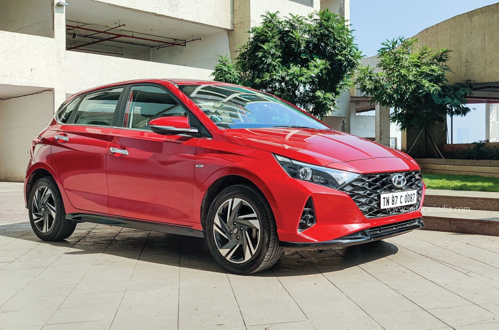
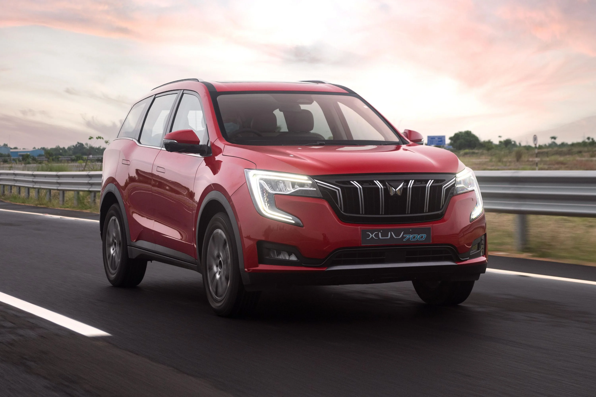

[style.css](https://github.com/user-attachments/files/22466915/style.css)# Car-rental[Uploadin
h1 {
  color: #1C1C1C;
  text-align: center;
  font-size: 40px;
}

.car-container {
  display: flex;              /* Makes them side by side */
  justify-content: center;    /* Centers the cards */
  gap: 20px;                  /* Space between cards */
  flex-wrap: wrap;            /* Allows wrapping on small screens */
  padding: 20px;
}

body { font-family: Arial; background: #f7f7f7; text-align: center; }
.car { background: white; width: 250px; padding: 15px; margin: 10px auto; border-radius: 10px; }
img { width: 100%; border-radius: 8px; }
button { background: rgb(0, 0, 0); color: rgb(239, 233, 233); padding: 8px; border: none; cursor: pointer; }
button:hover { background: #d2d2dd; }
g style.css…]()

Peer to Peer Car Rental

[Uploading index.html…]()
<!DOCTYPE html>
<html>
    <head>
        <title>
            Self Drive Rental
        </title>
        <link rel="stylesheet" href="style.css">
    </head>
    <body>
        <h1>
            Peer-to-Peer Self Drive Rentals
        </h1>
        

        

            
            <h3>Hyundai i20</h3>
            
Rs.1500day

            <button>Book now</button>
        

        

            
            <h3>Ertiga</h3>
            
Rs.2500/day

            <button>Book now</button>
        

        

            
            <h3>Hyundai Creta</h3>
            
Rs2000/day

            <button>Book now</button>
        

        

            
            <h3>Xuv-700</h3>
            
Rs.3000/day

            <button>Book now</button>
        

            
            <h3>Swift-Dzire</h3>
            
Rs.1200/day

            <button>Book now</button>

        

        

        <form>
        Enter-Name<input type="text" placeholder="Your Name" required>
        Enter-licence Details<input type="text" placeholder="License Number" required>  
                Start-Date<input type="date" required>
                    End-Date<input type="date" required>  
                    Choose_The_Car<input type="text" placeholder="Choose_Car" required>  
        <button type="submit">Submit Booking</button>
    </form>
    </body>
</html>

https://github.com/Sanabhi04/Car-rental.git
